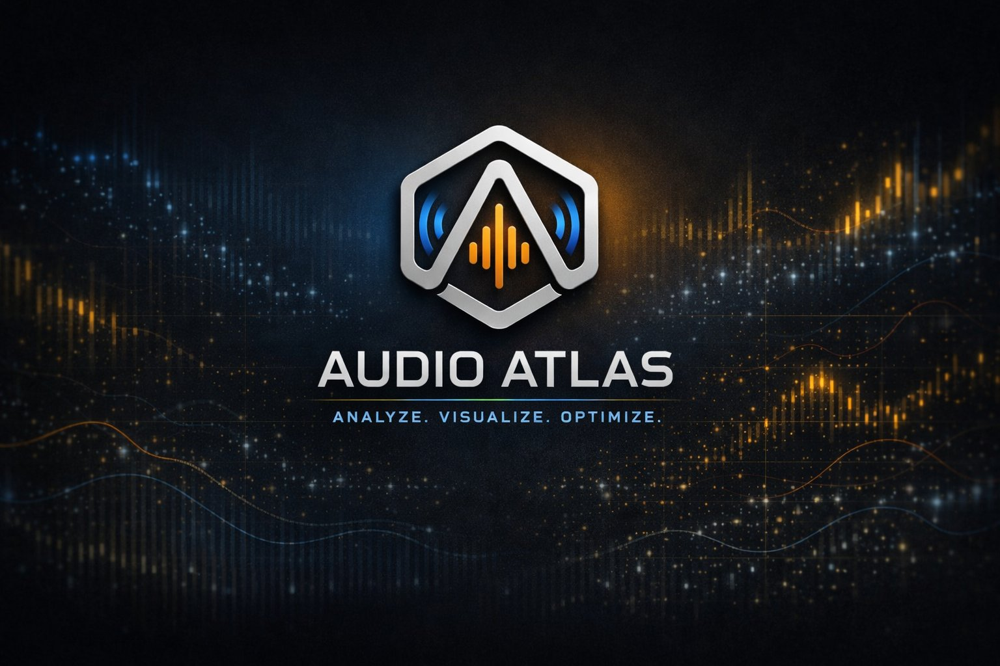

<div align="center">
  
</div>

<br/>

<div align="center">

[](CHANGELOG.md)&nbsp;
[](https://unity.com/releases/unity-6)&nbsp;
[](#requirements)&nbsp;
[](LICENSE.md)

</div>

<div align="center">

**The professional-grade audio diagnostics and validation toolkit for Unity 6.**  
Real-time monitoring · Automated scanning · Zero overhead in shipped builds.

[Installation](getting-started/installation.md) · [Quick Start](getting-started/quick-start.md) · [API Reference](api/runtime-api.md) · [CI Integration](ci/ci-integration.md) · [Contact Support](mailto:tools.studio@zohomail.in)

</div>

---

> **This is the public documentation repository for Audio Atlas v1.0.0.**  
> It contains structured reference documentation only — no source code is included.  
> The source repository is private. Purchasing the asset grants a Unity package, not repository access.  
> To enquire about repository access, [Contact Support](mailto:tools.studio@zohomail.in).

---

## Overview

Audio bugs are invisible. Voice limits silently drop critical sounds. Stereo clips nullify 3D positioning. `AudioSource` components play at zero volume while occupying voice slots. Mixer routing breaks mid-project and nobody notices until QA.

Unity's built-in tools provide no real-time visibility into any of this.

**Audio Atlas gives you complete visibility:**

- Every active `AudioSource` with live volume, pitch, distance, and priority
- Every mixer group with live signal levels and full routing integrity
- Every voice steal event — source stolen, source stealing, timestamp
- An automated rule scanner that catches 12 categories of misconfiguration
- A composite health score graded A–F, updated live every ~0.5 seconds

All of it in a single docked editor window. No scene setup. No code changes required to start.

---

## Key Features

### Real-Time Monitoring

| Panel | What You See |
|---|---|
| **Live Sources** | Every tracked `AudioSource` — state, clip, volume, pitch, blend, distance, priority, mixer group |
| **Mixer Graph** | Visual node graph of your full `AudioMixer` hierarchy with live signal levels per group |
| **Event Log** | Timestamped ring buffer of play, stop, and steal events — 512 capacity, exportable to CSV |

### Analysis & Validation

| Panel | What You See |
|---|---|
| **Project Scanner** | 12 rules (AA-001→AA-012), per-rule severity, inline fix buttons with full undo support |
| **Signal Chain** | Full signal path from any selected `AudioSource` to the output bus |
| **Source Inspector** | Serialized vs. runtime property comparison — surfaces drift caused by runtime modification |
| **Scene Heatmap** | 3D spatial heatmap rendered into the Scene View showing audio activity density |

### Intelligence Layer

| Panel | What You See |
|---|---|
| **Health & Metrics** | Composite A–F health grade from 5 weighted sub-scores, updated every ~0.5 s |
| **Insights** | Ranked actionable insight cards — clip spam, co-occurrence, steal bursts |

### Asset Management

| Panel | What You Do |
|---|---|
| **Clip Search** | Full-project clip inventory — sort, filter, find duplicates, find unused, export CSV |
| **Memory Profiler** | Per-clip runtime memory footprint with load type and compression analysis |
| **Asset References** | Cross-reference any clip to every `AudioSource` consuming it |
| **Budget Guard** | Per-platform voice and memory budget enforcement with live violation alerts |

### Productivity & Build

| Feature | Detail |
|---|---|
| **Session Diff** | Compare any two sessions across 6 behavioral dimensions |
| **Voice Drop Sim** | Deterministic voice steal probability estimation — no randomisation |
| **Waveform Scope** | Real-time DSP waveform — zero per-frame allocations |
| **CI Integration** | `CIBridge.Run()` — headless batch scan, JSON report, exit codes 0/1/2 |
| **Build History** | Health score trend across builds with sparkline chart |

---

## System Architecture

```
AudioAtlas.Editor      → editor-only, stripped from all builds
        │ depends on
AudioAtlas.Runtime     → conditional (UNITY_EDITOR || AUDIOATLAS_DEBUG)
                         AudioRegistry · EventBus · MetricsCollector
                         AudioAtlasBootstrap · AudioAtlasRuntime engine
                         SourceTracker · VoiceStealTracker · HeatmapSampler
                         AudioIntelligenceEngine · MixerAnalyzer

AudioAtlas.Examples    → editor-only, excluded from builds
```

Bootstrap activates via `[RuntimeInitializeOnLoadMethod(BeforeSceneLoad)]` — no scene setup required. See [Architecture](core-systems/architecture.md) for the full lifecycle and data model.

---

## Zero Production Overhead

```
AudioAtlas.Runtime   → ships only if you reference it + define AUDIOATLAS_DEBUG
AudioAtlas.Editor    → editor-only assembly, never built into player
AudioAtlas.Examples  → excluded from all builds
```

When `AUDIOATLAS_DEBUG` is undefined, the compiler eliminates all tracking code. The bootstrap becomes a no-op.

---

## Getting Started

```
Window → Audio → Audio Atlas     Ctrl+Shift+A
```

Import the package, open the window, enter Play Mode. Tracking activates automatically. See the [Quick Start guide](getting-started/quick-start.md) for the complete first-session walkthrough.

---

## Acquiring Audio Atlas

Audio Atlas is a paid commercial asset. A valid license is required before use.

**Unity Asset Store (primary):** Search "Audio Atlas" on the Asset Store. After purchase, install directly from **Package Manager → My Assets**.

**Other authorised marketplaces:** Download the `.unitypackage` and follow the [Installation guide](getting-started/installation.md).

> **Source code repository access is not included with purchase.**  
> The asset is delivered exclusively as a Unity package. The development repository is private.  
> Repository access may be granted separately upon written request — [Contact Support](mailto:tools.studio@zohomail.in).

---

## Requirements

| | Minimum |
|---|---|
| Unity | **6000.0** (Unity 6) |
| .NET Compatibility | Standard 2.1 |
| Scripting Backend | Mono or IL2CPP |
| Render Pipeline | Built-in, URP, or HDRP |
| Editor Platform | Windows · macOS · Linux |

---

## Documentation Map

| Document | Contents |
|---|---|
| [Installation](getting-started/installation.md) | Import methods, package layout, assembly references |
| [Quick Start](getting-started/quick-start.md) | First session walkthrough — live data in under 5 minutes |
| [Architecture](core-systems/architecture.md) | Assembly design, bootstrap lifecycle, AudioRegistry, ScanCoordinator |
| [EventBus Reference](core-systems/event-bus.md) | All 32 events, payload meanings, subscribe/raise/clear API |
| [Intelligence Engine](core-systems/intelligence-engine.md) | Health score algorithm, insight detection, sub-score formulas |
| [Panels Reference](panels/panels-reference.md) | Every panel documented with columns, constraints, and interactions |
| [Scanner Rules](panels/scanner-rules.md) | AA-001 → AA-012 — root cause, auto-fix, suppress |
| [Runtime API](api/runtime-api.md) | AudioRegistry, EventBus, AudioAtlasRuntime, structs |
| [Configuration](configuration/settings-reference.md) | Every setting with type, default, and effect |
| [CI Integration](ci/ci-integration.md) | GitHub Actions, Jenkins, exit codes, JSON report schema |
| [Troubleshooting](troubleshooting/common-issues.md) | Root causes and resolutions for all known issues |
| [FAQ](troubleshooting/faq.md) | Licensing, technical, and integration questions |
| [Changelog](CHANGELOG.md) | Full version history |
| [License](LICENSE.md) | Commercial license terms |

---

## Support

[Contact Support](mailto:tools.studio@zohomail.in) · [Report a Bug](mailto:tools.studio@zohomail.in?subject=Bug%20Report:%20AudioAtlas) · [Request a Feature](mailto:tools.studio@zohomail.in?subject=Feature%20Request:%20AudioAtlas)

Bug reports filed via **Window → Audio → Audio Atlas → About → Report a Bug** are automatically pre-populated with your Unity version, OS, and Audio Atlas version.

---

## License Summary

Audio Atlas is distributed under a commercial seat-based license. One purchase covers one developer or one studio. The asset may be used in unlimited projects. Redistribution of source code, sublicensing, and reselling are prohibited. See [LICENSE](LICENSE.md) for complete terms.

---

<div align="center">

Built by **Tools Studio**  
*Analyze. Visualize. Optimize.*

</div>
